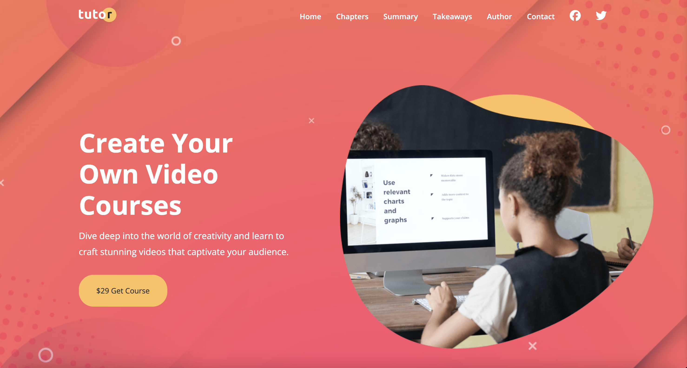

# Tutor Website

A professional and responsive website designed for promoting and selling online video courses. This project features a modern design, interactive sections, and a user-friendly layout to engage visitors and showcase course content effectively.

## Features

- **Hero Section**: Captivating introduction with a call-to-action for purchasing the course.
- **Course Highlights**: Detailed sections outlining what users will learn, key takeaways, and course chapters.
- **Responsive Design**: Fully responsive layout that works seamlessly across all devices.
- **Interactive Elements**: Includes a mobile-friendly navigation menu, social media links, and a newsletter subscription form.
- **Author and Stats Section**: Highlights the course author’s expertise and key statistics about the course's success.
- **Social Media Integration**: Links to popular social platforms for easy sharing and engagement.

## Technologies Used

- HTML
- CSS
- JavaScript
- Font Awesome for icons
- Google Fonts for typography

## How to Use

- Clone the repository.
- Open `index.html` in your browser.
- Explore the website to view course details, chapters, and other interactive sections.
- Customize the content by editing the HTML, CSS, and JavaScript files.
